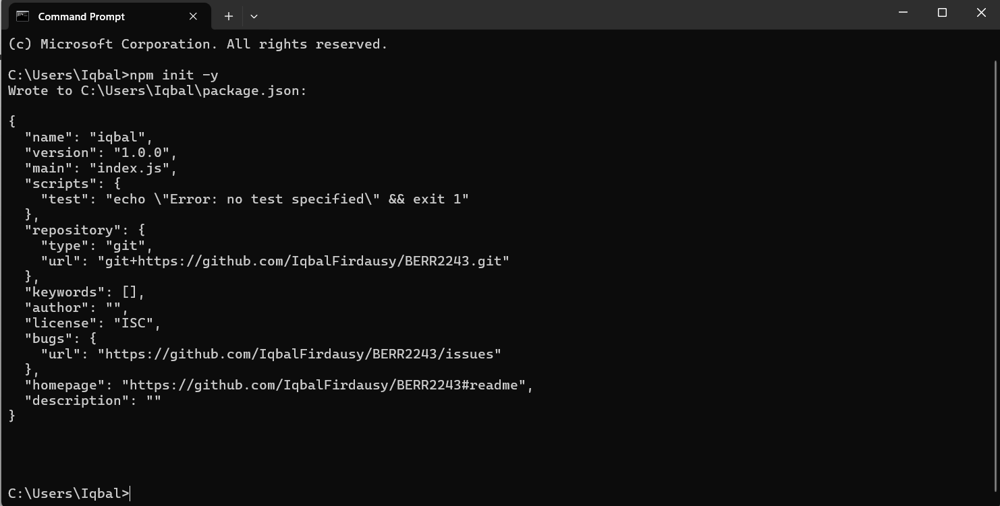
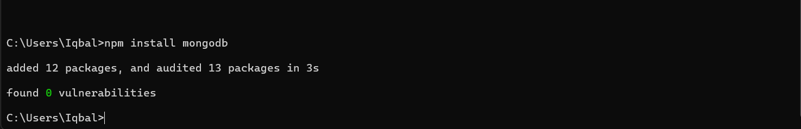
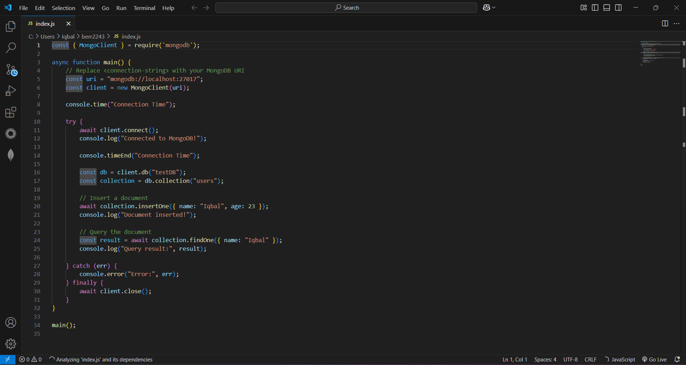
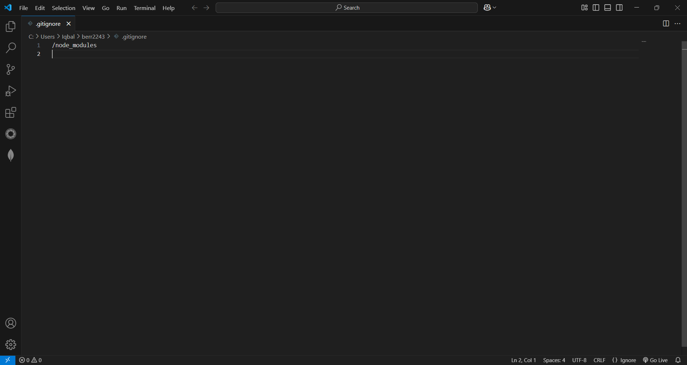

### **Exercise1 : Environment Setup, Git Workflows & Hello MongoDB**

##### **Step 1: Install Development Tools**

1. **Install VSCode**  
   -   
     Download from [code.visualstudio.com](https://code.visualstudio.com).  
   -   
     Install recommended extensions: **MongoDB for VSCode**.  

2. **Install NodeJS & npm**  
   -   
     Download the **LTS version** from [nodejs.org](https://nodejs.org).  
   - Verify installation using:  
   -   

3. **Install MongoDB**  
   -   
     Follow the download and installation guide and **start the service**.  

4. **Install Git**  
   -   
     Download from [git-scm.com](https://git-scm.com).  
   -   
     Configure **Git username/email**.  

5. **Install MongoDB Compass (Optional)**  
   -   
     Download from [MongoDB Compass](https://www.mongodb.com/try/download/compass). 

##### **Step 2: Git Basics & Repository Setup**

1. **Create a GitHub Account**  
   -   
     Create an account using your **student email**.  
   -   
     Create a **new Git Repository**.  

2. **Create a README.md File**  
   Document your installation steps.  
   -   
     Create a **new Git Repository**.  

3. **Commit and Push to GitHub**  
   ```sh
   git add .
   git commit -m "Initial commit: Setup Documentation"
   git branch -M main
   git remote add origin https://github.com/YOUR_USERNAME/YOUR_REPO.git  # Replace with your repo link
   git push -u origin main

##### **Step 3: Create a "Hello MongoDB" NodeJS Script**

1. **Initialize a NodeJS Project**  
   -   

2. **Install MongoDB Driver**  
   -   

3. **Create `index.js`**  
   -   

4. **Run the Script**  
   ```sh
   node index.js

##### **Step 4: Push Code to GitHub**  

1. **Create a `.gitignore` file**  

2. **Add `node_modules` to the `.gitignore` file**  
   -   

3. **Commit and Push Changes**  
   ```sh
   git add .
   git commit -m "Add NodeJS script and MongoDB connection"
   git push -u origin main