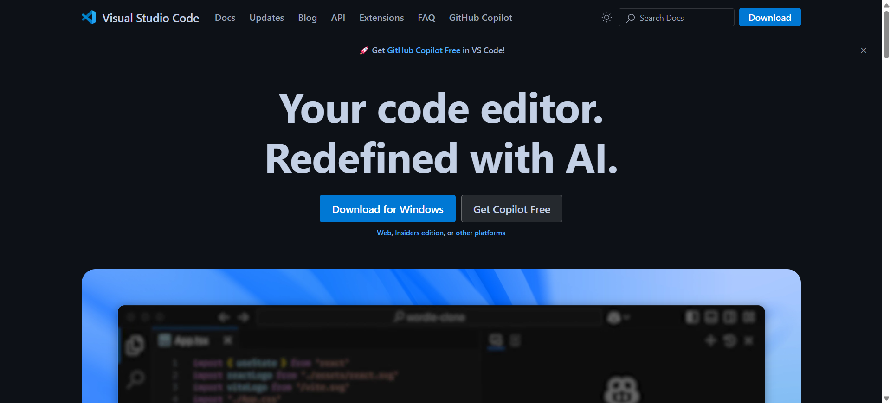
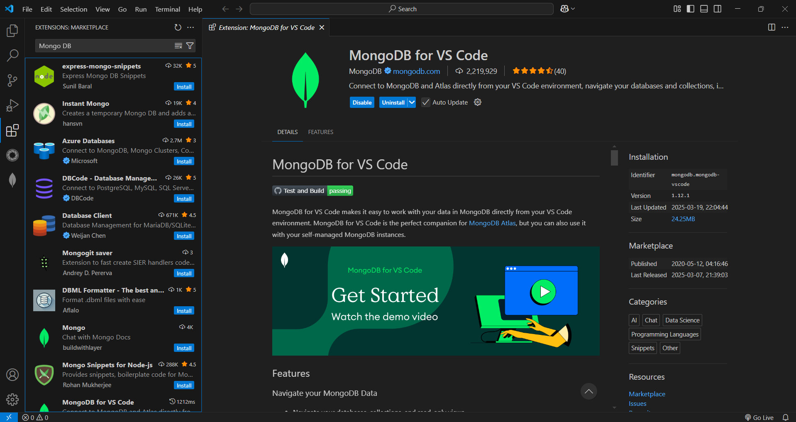
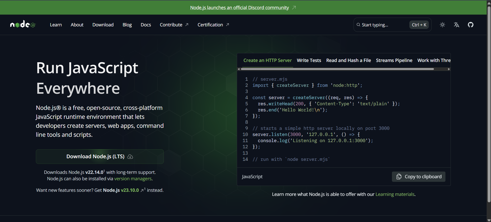
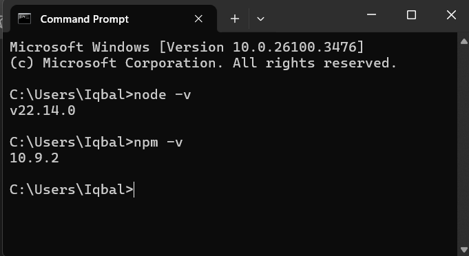
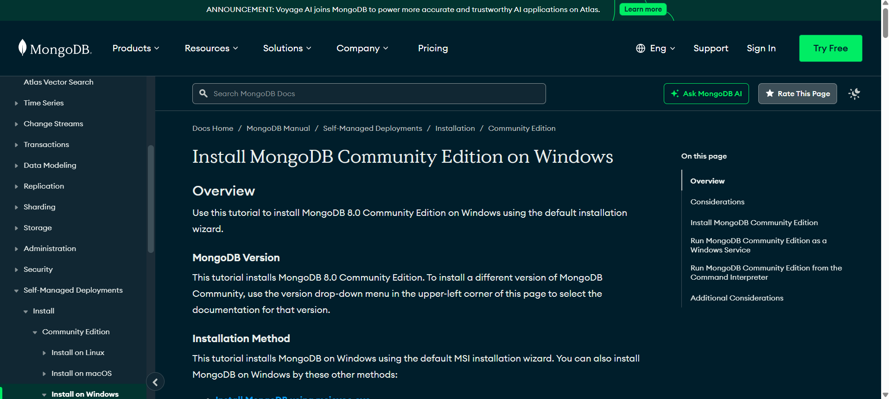
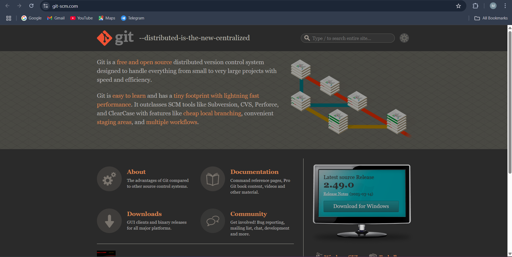
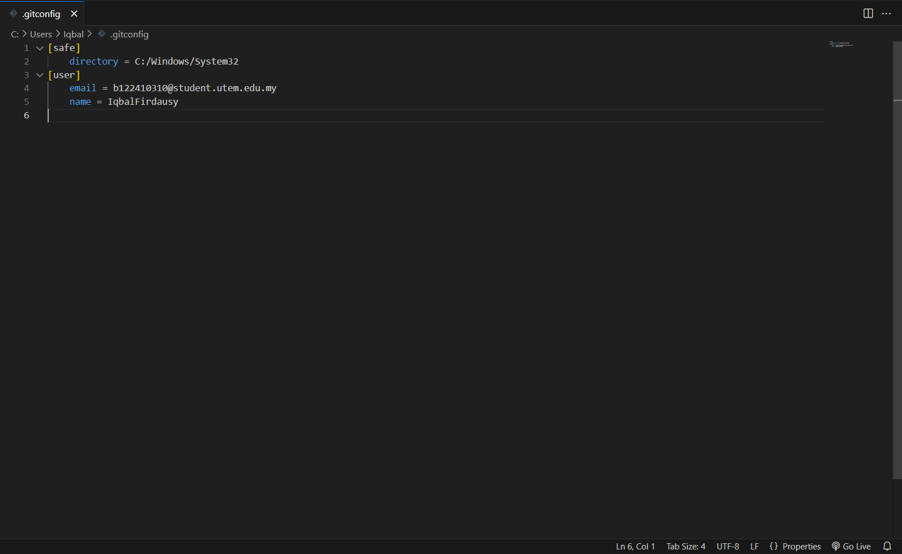
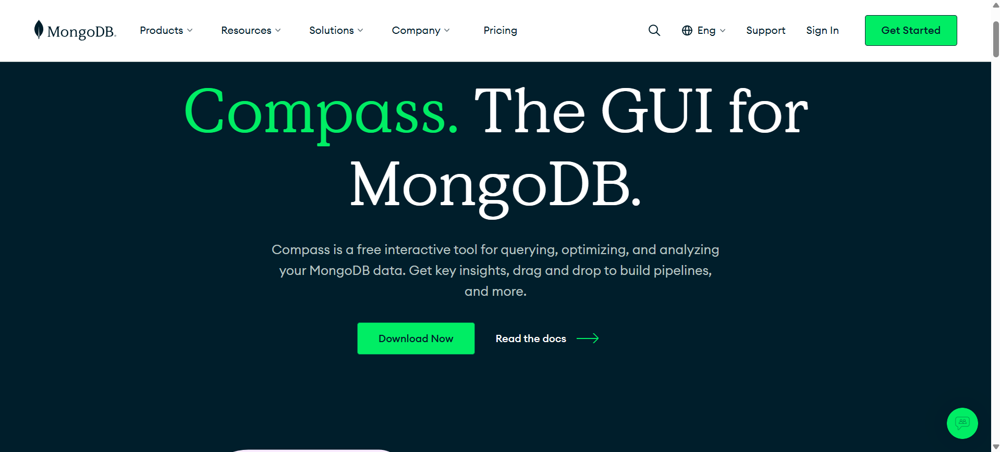
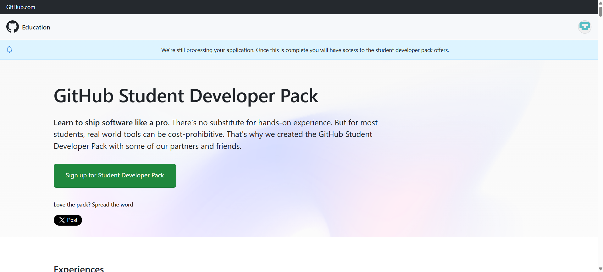
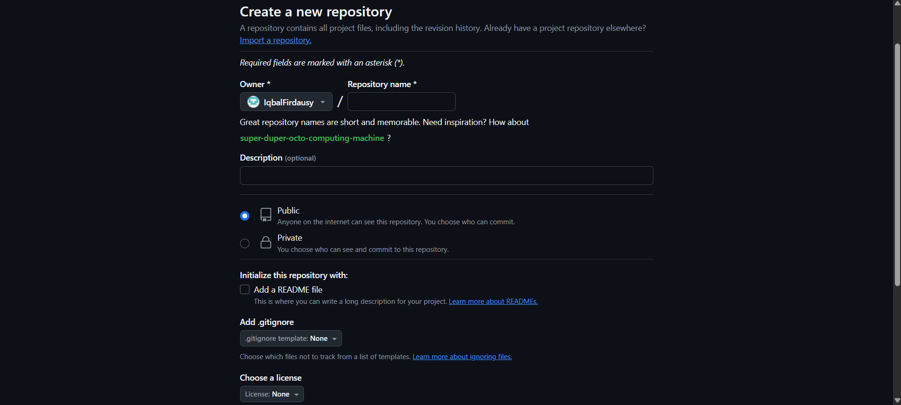

### Exercise 1: Environment Setup, Git Workflows & Hello MongoDB

##### Step 1: Install Development Tools

1. Install VSCode  
   -   
     Download from [code.visualstudio.com](https://code.visualstudio.com).  
   -   
     Install recommended extensions: MongoDB for VSCode.  

2. Install NodeJS & npm  
   -   
     Download the LTS version from [nodejs.org](https://nodejs.org).  
   - Verify installation using:  
   -   

3. Install MongoDB  
   -   
     Follow the download and installation guide, then start the service.  

4. Install Git  
   -   
     Download from [git-scm.com](https://git-scm.com).  
   -   
     Configure Git username and email.  

5. Install MongoDB Compass (Optional)  
   -   
     Download from [MongoDB Compass](https://www.mongodb.com/try/download/compass).  

##### Step 2: Git Basics & Repository Setup

1. Create a GitHub Account  
   -   
     Sign up using your student email.  
   -   
     Create a new Git repository.  

2. Create a README.md File  
   - Document your installation steps.  

3. Commit and Push to GitHub  
   ```sh
   git add .
   git commit -m "Initial commit: Setup Documentation"
   git branch -M main
   git remote add origin https://github.com/IqbalFirdausy/BERR2243.git  # Replace with your repository URL
   git push -u origin main
